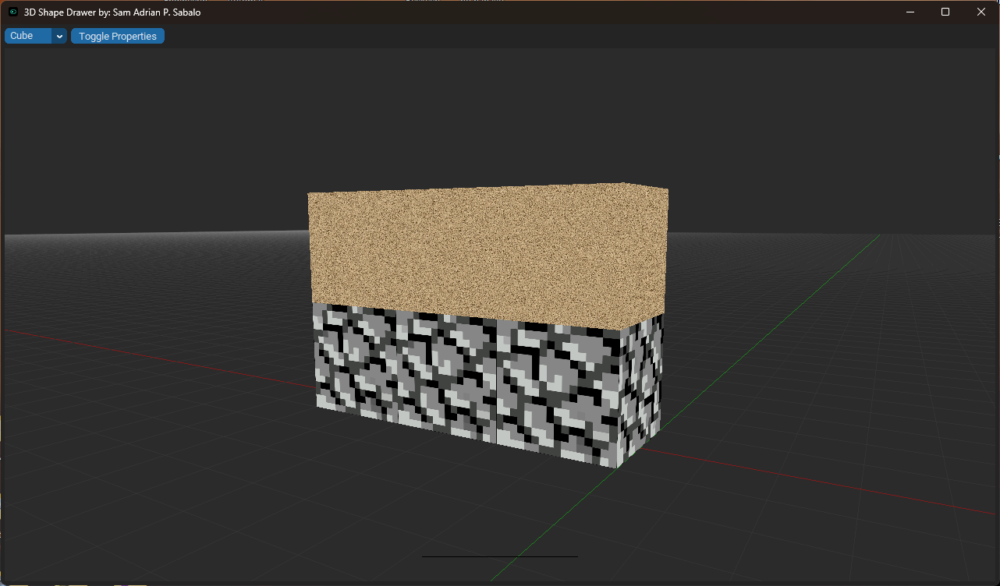

# 🧱 OpenGL 3D Playground (Immediate Mode Rendering)

## 🎯 Project Purpose

This project was created as a personal practice tool to get comfortable with OpenGL programming in Python.
It focuses on **immediate mode rendering**, giving users an interactive way to add, move, resize, and manipulate 3D objects in a simple GUI application. It's also a great starting point for anyone looking to explore 3D graphics or build their own modeling tools in Python.

## 🛠️ Features

* 🧊 **Add and draw 3D shapes**
* 📏 **Resize** and **scale** shapes
* 🔄 **Rotate** shapes in 3D space
* 📦 **Move** objects along the X, Y, and Z axes
* 🎨 **Change colors** or **apply textures**
* 🗑️ **Delete** shapes from the scene
* 📋 **Duplicate** shapes easily
* ⌨️ **Key shortcut support** for faster interactions

## 💡 Future Improvements

Here’s a list of features I plan to implement or encourage others to contribute to:

* ✨ Individual vertex-level editing (translation/movement)
* ↔️ Resize shape width and height separately
* 🕹️ Full mouse support for dragging, rotating, selecting
* ↩️ Undo/redo functionality
* 🌐 Support for planes and other primitives
* 📂 3D file import (OBJ, STL, PLY, etc.)
* 💾 Save/load/export current scenes or layouts

## 🎮 Controls Overview (Key Shortcuts)

| Action          | Shortcut/Interaction |
| --------------- | -------------------- |
| Add shape       | Via GUI or key bind  |
| Move shape      | Arrow keys / GUI     |
| Rotate shape    | R key or GUI slider  |
| Change color    | Use CTkColorPicker   |
| Duplicate shape | D key                |
| Delete shape    | Del key              |
| Apply texture   | From file chooser    |

*Mouse interaction support planned for future.*

## 📸 Images

| GUI Interface | Shape Samples         |
| ------------- | --------------------- |
|  |  |

## 📦 Prerequisites

* Python 3.8 or later
* pip
* (Optional) virtualenv for isolated setup

## 🔧 Installation

1. **Clone the repository**:

   ```bash
   git clone https://github.com/your-username/3D-Shape-Drawer.git
   cd 3D-Shape-Drawer
   ```

2. **Install required packages**:

   ```bash
   pip install -r requirements.txt
   ```

## 🚀 Running the App

Simply run:

```bash
python app.py
```

You should now see the main GUI window with a 3D rendering canvas. Add and manipulate shapes using the buttons and available tools.

## 🧰 Tech Stack

* **Python 3**
* **PyOpenGL** – For all 3D rendering logic
* **pyopengltk** – Allows OpenGL rendering within a Tkinter GUI
* **CustomTkinter** – Provides a modern GUI appearance and widgets
* **PIL/Pillow** – Used for texture loading and image handling

## 🙏 Acknowledgements

* [CTkColorPicker](https://github.com/Akascape/CTkColorPicker): A sleek alternative to the basic Tkinter color picker.
* [pyopengltk](https://github.com/jonwright/pyopengltk): The bridge that makes OpenGL inside Tkinter possible.

## ⚖️ License

This project is licensed under the **GNU General Public License v3.0**.
See the [LICENSE](LICENSE) file for more information.

The GPL-3.0 license allows you to use, modify, and distribute this software under specific terms, provided that any derivative work also follows the same license.

## 🧪 Technical Notes

* This project uses **immediate mode rendering** (`glBegin`, `glVertex`, etc.), which is outdated in modern OpenGL but excellent for learning.
* Consider migrating to **modern OpenGL (shaders, VBOs, VAOs)** if you plan to optimize or extend the app for real-world applications or games.
